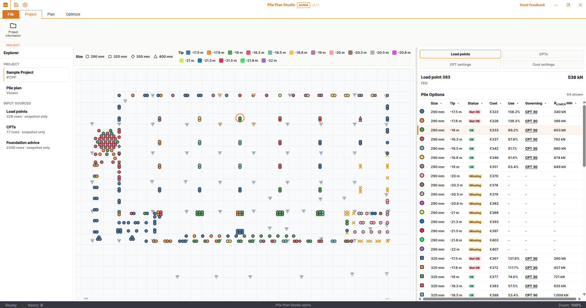
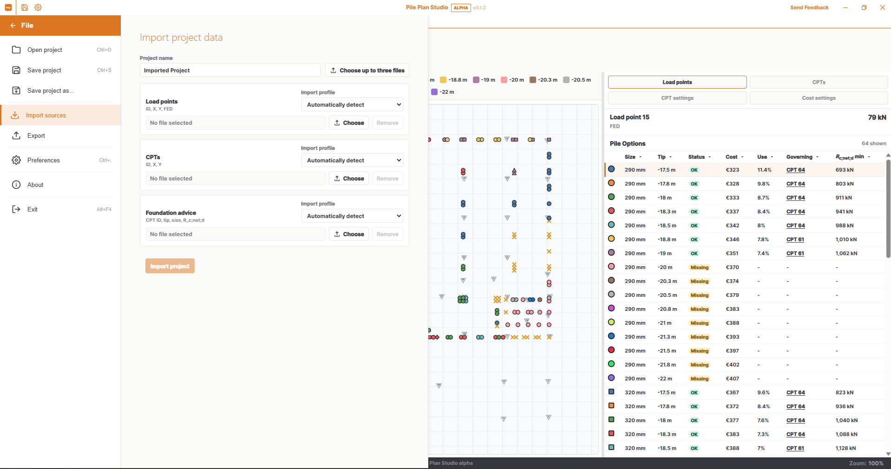
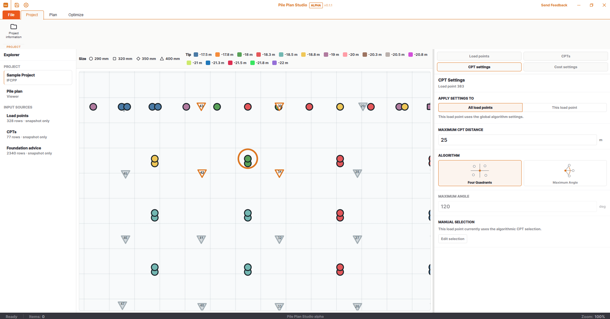
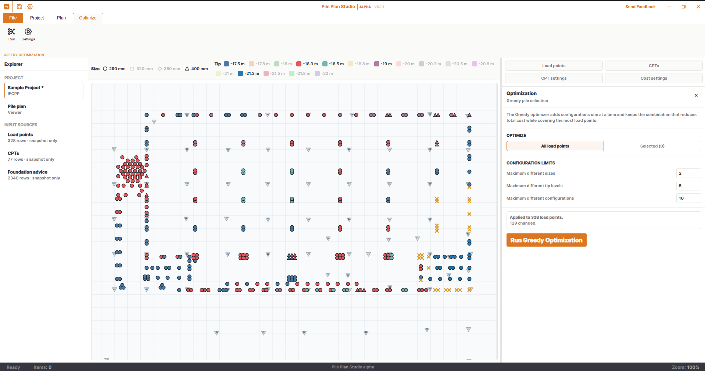

<h1 align="center">Pile Plan Studio</h1>

<p align="center">
  <strong>Explore, compare, and assign pile configurations for structural load points.</strong>
</p>

<p align="center">
  <a href="RELEASE_NOTES.md"></a>
  <a href="https://github.com/OpenAEC-Foundation/pile-plan-studio/releases"></a>
  <a href="LICENSE"></a>
  <a href="https://pile-plan-studio.open-aec.com/"></a>
  
  
</p>

<p align="center">
  <a href="https://pile-plan-studio.open-aec.com/"><strong>Try Pile Plan Studio in your browser</strong></a>
</p>

---

Pile Plan Studio is an open-source engineering application for reviewing pile
options and assembling a practical pile plan. It brings structural load points,
CPTs, foundation advice, utilization, pile costs, and configuration choices
together in one interactive plan.

The engineering core is written in Rust. The same calculation model runs
natively in the Tauri desktop application and through WebAssembly in the
browser.

<p align="center">
  
</p>

> [!WARNING]
> Pile Plan Studio is currently a public alpha. Engineering results must be
> verified by a qualified professional. The application supports engineering
> decisions but does not replace responsibility for the foundation design.

## Highlights

- Inspect valid, insufficient, and missing pile configurations for every load
  point.
- Select CPTs automatically using quadrant or maximum-angle rules.
- Override the CPT selection manually for individual load points.
- Compare utilization, foundation resistance, and estimated cost.
- Assign one pile configuration to one or multiple selected load points.
- Filter the available sizes and tip levels directly from the plan legend.
- Run a greedy optimization with limits on sizes, tip levels, and complete
  configurations.
- Save project data, settings, pile assignments, and CPT choices in IFCPP.
- Export the current pile assignments and selected CPT identifiers to Excel or
  CSV.
- Use the same Rust calculation core in the browser and Windows desktop app.

## Screenshots

### Import project data

Import load points, CPT coordinates, and foundation advice from separate CSV or
XLSX sources and assign each file to its project role.

<p align="center">
  
</p>

### Configure CPT selection

Set the maximum CPT distance, choose the selection algorithm, apply settings
globally or locally, and override the resulting selection when engineering
judgement requires it.

<p align="center">
  
</p>

### Optimize the pile plan

The current greedy optimizer searches for a lower-cost plan while respecting
limits on the number of sizes, tip levels, and complete configurations.

<p align="center">
  
</p>

## Try or Install

The [live browser demo](https://pile-plan-studio.open-aec.com/) opens directly
with the sample project and is the quickest way to explore the application.

Signed Windows x64 installers will be published on the
[GitHub Releases page](https://github.com/OpenAEC-Foundation/pile-plan-studio/releases)
as soon as the code-signing setup is complete. The browser and desktop editions
use the same Rust calculation core.

See the [release notes](RELEASE_NOTES.md) for the changes in each alpha.

## Supported Project Data

Pile Plan Studio imports three source roles:

| Role | Required content | Formats |
| --- | --- | --- |
| Load points | ID, X, Y, F<sub>Ed</sub> | CSV, XLSX |
| CPTs | ID, X, Y | CSV, XLSX |
| Foundation advice | CPT ID, pile tip level, pile size, R<sub>c;net;d</sub> | CSV, XLSX |

For the standard tabular profile, these columns must appear in the order shown
in the table. The importer reads columns by position rather than by header
name:

- load points: `ID`, `X`, `Y`, F<sub>Ed</sub>;
- CPTs: `ID`, `X`, `Y`;
- foundation advice: `CPT ID`, `pile tip level`, `pile size`,
  R<sub>c;net;d</sub>.

One header row is optional, and additional columns after the required columns
are allowed. The RFEM load-point profile is the exception: it detects the
required RFEM columns by their headers, so their position is not fixed.

The source files may be selected together and assigned to their roles before
import. Load points can use either the standard tabular profile or the
automatically detected RFEM Excel export profile. The RFEM profile joins node
coordinates and reactions by node number and currently interprets the design
load as F<sub>Ed</sub> = |Min PZ'|.

Imported data, source profiles, project settings, selected piles, and manual
CPT choices are stored in an `.ifcpp` project file.

## Selection and Inspection

- Click a load point to select it.
- Use **Shift+click** to add or remove a load point from the selection.
- Use **Shift+drag** on empty viewer space to select load points with a lasso.
- Hover over a marker to inspect its compact information.
- When markers overlap, press **Space** to cycle through the candidates beneath
  the pointer before clicking.
- Use **Shift+click** on a pile size or tip level in the legend to select load
  points that currently use it.
- Press **Escape** or click empty viewer space to clear the selection.

In the pile-options table, click a row to assign its configuration. With
multiple load points selected, the table shows their common options and applies
the chosen configuration to all of them. Column headers support sorting and
filtering.

## Alpha Scope

The CPT-selection rules are configurable approximations rather than an
objective engineering truth. The greedy optimizer supports decision-making but
does not guarantee a globally optimal pile plan.

See [Known Alpha Limitations](docs/known-limitations.md) for the complete scope.

## Architecture

| Layer | Technology | Responsibility |
| --- | --- | --- |
| Engineering core | Rust | Project model, import, CPT selection, pile options, costing, optimization |
| Browser core | WebAssembly | Thin interface to the same Rust engineering core |
| Interface | React + TypeScript | Application state, interaction, rendering, and presentation |
| Desktop | Tauri 2 | Native window, file access, and Windows packaging |

Repository layout:

- `crates/pile-plan-core`: engineering domain and calculations;
- `crates/pile-plan-wasm`: WebAssembly interface;
- `apps/pile-plan-studio`: React application and Tauri desktop shell;
- `sample_project`: example IFCPP project and source files;
- `docs`: architecture, deployment, screenshots, and limitations.

See [Architecture](docs/architecture.md) for more detail.

## Build from Source

Requirements:

- Node.js 20 or newer;
- current stable Rust;
- `wasm-pack`;
- the [Tauri prerequisites](https://v2.tauri.app/start/prerequisites/) for
  desktop builds.

Run the browser development server:

```powershell
cd apps\pile-plan-studio
npm install
npm run dev
```

Run the automated tests:

```powershell
cargo test --workspace
cd apps\pile-plan-studio
npm test
```

Create the browser and Windows desktop builds:

```powershell
cd apps\pile-plan-studio
npm run build
npm run tauri build
```

See [Deployment](docs/deployment.md) for browser hosting and signed release
details.

## Contributing

Issues and pull requests are welcome. Keep engineering logic in the Rust core,
add focused tests for behavioral changes, and keep browser and desktop behavior
on the same project model.

Report bugs and ideas through the
[GitHub issue tracker](https://github.com/OpenAEC-Foundation/pile-plan-studio/issues).

### AI-assisted Development

Development of Pile Plan Studio has been assisted by AI coding tools. Design
decisions, engineering requirements, review, and validation remain under human
responsibility.

## License

Pile Plan Studio is licensed under the
[GNU Lesser General Public License v3.0 or later](LICENSE).
