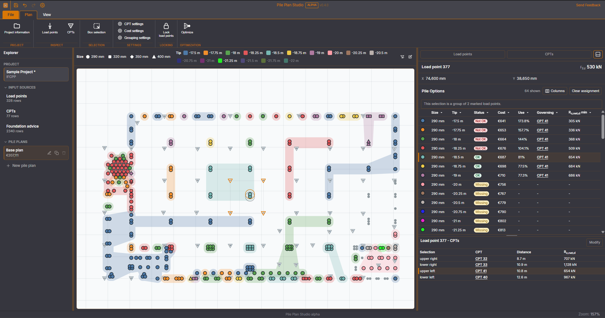
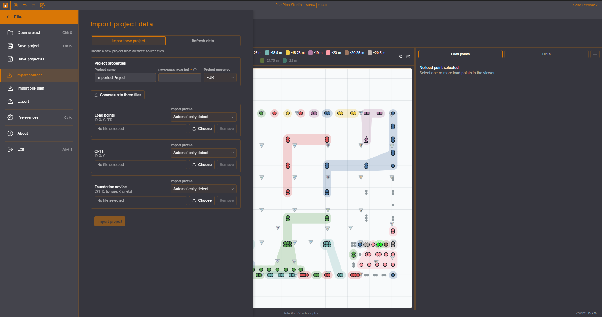
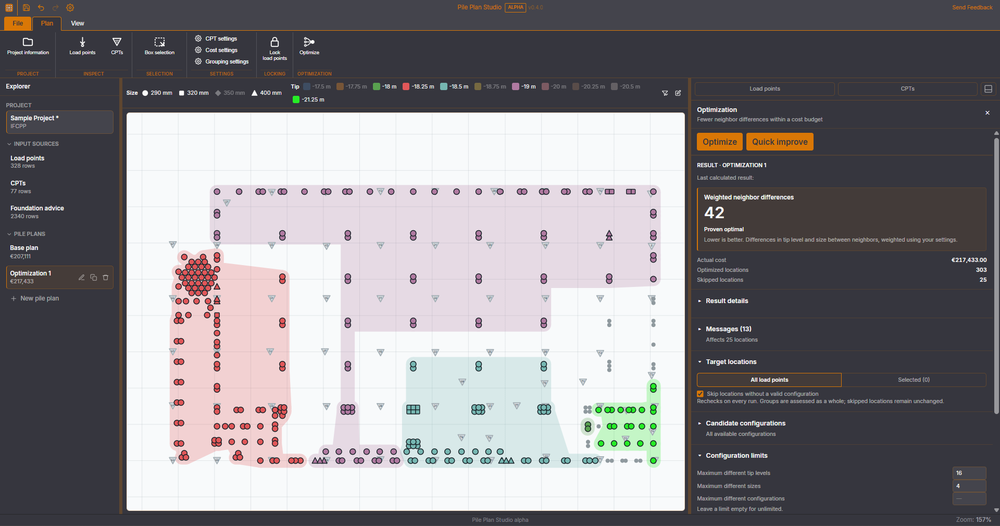

<h1 align="center">Pile Plan Studio</h1>

<p align="center">
  <strong>Explore, compare, and assign pile configurations for structural load points.</strong>
</p>

<p align="center">
  <a href="RELEASE_NOTES.md"></a>
  <a href="https://github.com/OpenAEC-Foundation/pile-plan-studio/releases"></a>
  <a href="LICENSE"></a>
  <a href="https://pile-plan-studio.open-aec.com/"></a>
  
  
</p>

<p align="center">
  <a href="https://pile-plan-studio.open-aec.com/"><strong>Try Pile Plan Studio in your browser</strong></a>
  &nbsp;&middot;&nbsp;
  <a href="https://github.com/OpenAEC-Foundation/pile-plan-studio/releases/latest"><strong>Download the Windows installer</strong></a>
</p>

---

Pile Plan Studio is an open-source engineering application for reviewing pile
options and assembling a practical pile plan. It brings structural load points,
CPTs, foundation advice, utilization, pile costs, and configuration choices
together in one interactive plan.

The engineering core is written in Rust. The same calculation model runs
natively in the Tauri desktop application and through WebAssembly in the
browser.

<p align="center">
  
</p>

> [!WARNING]
> Pile Plan Studio is currently a public alpha. Engineering results must be
> verified by a qualified professional. The application supports engineering
> decisions but does not replace responsibility for the foundation design.

## Highlights

- Review valid, insufficient, and missing pile options, compare utilization,
  resistance, and cost, and assign configurations to one or many load points.
- Select CPTs automatically using quadrant or maximum-angle rules, override the
  selection manually, and inspect load points and CPTs side by side.
- Import, inspect, and refresh load points, CPTs, and foundation advice while
  retaining matched assignments and CPT selections.
- Organize load points into shared-configuration groups, lock assignments per
  plan, and maintain multiple named pile-plan variants in one project.
- Minimize cost with HiGHS, limit configuration diversity, and optionally
  reduce differences between neighboring load points within a cost budget.
- Customize the plan legend, visible configurations, marker presentation,
  panels, and pile-option columns for compact inspection workflows.
- Save projects as IFCPP with undo, redo, and browser recovery; import existing
  pile plans and export assignments and CPT identifiers to Excel or CSV.
- Keep project costs separate from application preferences while using the same
  Rust calculation core in the browser and Windows desktop application.

## Screenshots

### Import project data

Import load points, CPT coordinates, and foundation advice from separate CSV or
XLSX sources and assign each file to its project role.

<p align="center">
  
</p>

### Optimize the pile plan

The Optimization panel first finds a constrained cost reference. Optional
coherence optimization reduces weighted tip-level and size differences between
neighbors within a cost budget (5% extra by default). Quick improve provides a
local alternative to the spatial solver. Results distinguish the best solution
found from a proven optimum. See [Architecture](docs/architecture.md#ilp-optimization)
for the model and solver details.

<p align="center">
  
</p>

## Try or Install

The [live browser demo](https://pile-plan-studio.open-aec.com/) opens directly
with the sample project and is the quickest way to explore the application.

The latest signed Windows x64 installer is available on the
[GitHub Releases page](https://github.com/OpenAEC-Foundation/pile-plan-studio/releases).
After installation, `.ifcpp` project files can be opened directly from Windows
Explorer. If Pile Plan Studio is already running, the project opens in the
existing application window.
The browser and desktop editions use the same Rust calculation core.

See the [release notes](RELEASE_NOTES.md) for the changes in each alpha.

## Supported Project Data

Pile Plan Studio imports three source roles:

| Role | Required content | Formats |
| --- | --- | --- |
| Load points | ID, X, Y, F<sub>Ed</sub> | CSV, XLSX |
| CPTs | ID, X, Y | CSV, XLSX |
| Foundation advice | CPT ID, pile tip level, pile size, R<sub>c;net;d</sub> | CSV, XLSX |

In the current version, the standard tabular profile requires these columns to
appear in the order shown in the table. The importer currently reads columns by
position rather than by header name:

- load points: `ID`, `X`, `Y`, F<sub>Ed</sub>;
- CPTs: `ID`, `X`, `Y`;
- foundation advice: `CPT ID`, `pile tip level`, `pile size`,
  R<sub>c;net;d</sub>.

One header row is optional, and additional columns after the required columns
are allowed. Every load point must have an exact unique X/Y position. Source
previews identify all conflicting locations and their shared coordinates; an
import, refresh, or IFCPP project open is rejected until those conflicts are
resolved. Nearby but non-identical positions remain valid. The RFEM load-point
profile is the exception: it detects the
required RFEM columns by their headers. When those headers cannot be detected,
it falls back to the traditional RFEM layout with nodes on the first worksheet
and nodal reactions on the second.

Pile tip levels are expressed in metres and may resolve to whole millimetres
(up to three decimal places). Finer values are rejected with their source
locations instead of being rounded. The interface omits unnecessary trailing
decimals while retaining enough digits to distinguish every valid level.

The source files may be selected together and assigned to their roles before
import. Load points can use either the standard tabular profile or the
automatically detected RFEM Excel export profile. The RFEM profile joins node
coordinates and reactions by node number and currently interprets the design
load from the minimum PZ envelope (`Min PZ'`, `Min PZ`, or `Min`).

Imported data, source profiles, project settings, selected piles, and manual
CPT choices are stored in an `.ifcpp` project file.

When creating a project from source files, the building reference level is
required. Pile Plan Studio uses this reference as the pile cut-off level when
calculating pile lengths and costs.
The project currency defaults to the user's application preference. Changing a
currency code relabels costs; Pile Plan Studio does not perform currency
conversion.

The built-in pile-cost defaults and their assumptions are documented in
[`docs/pile-cost-defaults.md`](docs/pile-cost-defaults.md).

### Import an existing pile plan

Use **File > Import pile plan** to add an Excel or CSV table as a new pile plan
inside the active project. The imported plan is named after the source file and
opened immediately; existing plans remain unchanged. The Standard table
profile supports both pile assignments and CPT selections. The Legacy profile
supports existing `Vergrendeld.xlsx` files and imports pile assignments only;
rows that describe more than one pile are skipped with a warning.

Load points are first matched by ID when the imported coordinates agree. If
that check fails, Pile Plan Studio falls back to one unique coordinate match.
The coordinate tolerance is configurable for this workflow and defaults to
1 mm. Ambiguous, unmatched, or conflicting rows are skipped and reported in
the import preview before the project is changed.

## Selection and Inspection

- Click a load point to select it.
- Use **Shift+click** to add or remove a load point from the selection.
- Use **Shift+drag** on empty viewer space to select load points with a lasso.
- Hover over a marker to inspect its compact information.
- When markers overlap, press **Space** to cycle through the candidates beneath
  the pointer before clicking.
- Use **Shift+click** on a pile size or tip level in the legend to select load
  points that currently use it.
- Press **Escape** or click empty viewer space to clear the selection.

In the pile-options table, click a row to assign its configuration. With
multiple load points selected, the table shows their common options and applies
the chosen configuration to all of them. Column headers support sorting and
filtering.

Use **Columns** to show or hide columns and drag them into order. Single-point
and multiple-point layouts are remembered separately as application preferences.
Filters and sorting on hidden columns are inactive until those columns return.
The third button beside **Load points** and **CPTs** opens the combined view;
drag its divider to adjust the space for each section. Close an input-source
table with its top-right close button to return to the pile plan.

## Alpha Scope

The CPT-selection rules are configurable approximations rather than an
objective engineering truth. Optimization proves optimality only when reported
by the solver for the configured model. Quick improve and interrupted runs can
return feasible plans without proving that no better plan exists.

See [Known Alpha Limitations](docs/known-limitations.md) for the complete scope.

## Architecture

| Layer | Technology | Responsibility |
| --- | --- | --- |
| Engineering core | Rust | Project model, import, CPT selection, pile options, costing, optimization |
| Browser core | WebAssembly | Thin interface to the same Rust engineering core |
| Interface | React + TypeScript | Application state, interaction, rendering, and presentation |
| Desktop | Tauri 2 | Native window, file access, and Windows packaging |

Repository layout:

- `crates/pile-plan-core`: engineering domain and calculations;
- `crates/pile-plan-wasm`: WebAssembly interface;
- `apps/pile-plan-studio`: React application and Tauri desktop shell;
- `sample_project`: example IFCPP project and source files;
- `docs`: architecture, deployment, screenshots, and limitations.

See [Architecture](docs/architecture.md) for more detail.

## Build from Source

Requirements:

- a current Node.js 22 or 24 release (CI uses 22);
- current stable Rust;
- `wasm-pack`;
- the [Tauri prerequisites](https://v2.tauri.app/start/prerequisites/) for
  desktop builds.

Native Rust tests and desktop builds also need the C++ toolchain, CMake, and
libclang used by HiGHS. See [Build and deployment](docs/deployment.md) for setup
and the separate Tauri test command.

Run the browser development server:

```powershell
cd apps\pile-plan-studio
npm install
npm run dev
```

Run the automated tests:

```powershell
cargo test --workspace
cd apps\pile-plan-studio
npm test
```

Create the browser and Windows desktop builds:

```powershell
cd apps\pile-plan-studio
npm run build
npm run tauri build
```

See [Deployment](docs/deployment.md) for browser hosting and signed release
details.

## Contributing

Issues and pull requests are welcome. Keep engineering logic in the Rust core,
add focused tests for behavioral changes, and keep browser and desktop behavior
on the same project model.

Report bugs and ideas through the
[GitHub issue tracker](https://github.com/OpenAEC-Foundation/pile-plan-studio/issues).

### AI-assisted Development

Development of Pile Plan Studio has been assisted by AI coding tools. Design
decisions, engineering requirements, review, and validation remain under human
responsibility.

## License

Pile Plan Studio is licensed under the
[GNU Lesser General Public License v3.0 or later](LICENSE).
